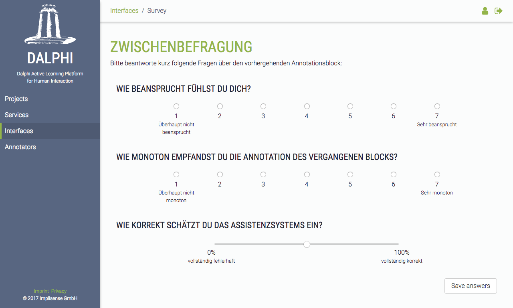

# Survey interface for Dalphi

This interface can be used to annotator surveys within the annotation process. A supporting iterate service can incude survey documents into the generated annotation documents to let the annotators answer a custom survey between the annotations. Integrate it to your [DALPHI](https://github.com/Dalphi/dalphi) project by copy'n'pasteing the HTML / CoffeeScript / SCSS source codes.



## How to use

A supporting iteration service generates survey documents of the following structure. The interface renders the correct input fields autonomous. Just include this interface to your project and adjust your iteration service to generate documents fo the `survey` type.

## Expected payload

```
{
  "title": "Questions",
  "description": "Please answer the following questions:",
  "questions": [
    {
      "title": "How is your cognitive load?",
			"mandatory": true,
      "scale": "interval",
      "id": "stress",
      "values": [
        { "value": 0, "label": "not stressed" },
        { "value": 1 },
        { "value": 2 },
        { "value": 3 },
        { "value": 4 },
        { "value": 5, "label": "very stressed" }
      ],
      "selected": -1
    },
    {
      "title": "How old are you?",
      "mandatory": false,
      "id": "age",
      "scale": "ratio",
      "value_unit": "years",
      "bounds": {
				"lower": {
					"value": 0,
					"label": "just born"
				},
				"upper": {
					"value": 120,
					"label": "very old"
				}
			},
      "selected": -1
    }
  ]
}
```

A selection of a question will set the `selected` attribute of each question.

## Contributing

1. Fork it
2. Create your feature branch (`git checkout -b my-new-feature`)
3. Commit your changes (`git commit -am 'Added awesome feature'`)
4. Push to the branch (`git push origin my-new-feature`)
5. Create new Pull Request

## License

See [LICENSE](https://raw.githubusercontent.com/Dalphi/interface-ner_complete/master/LICENSE).

## About

This interface as well as DALPHI is maintained and funded by [Implisense](http://implisense.com/).

We love open source software and are [hiring](http://implisense.com/en/jobs/)!
